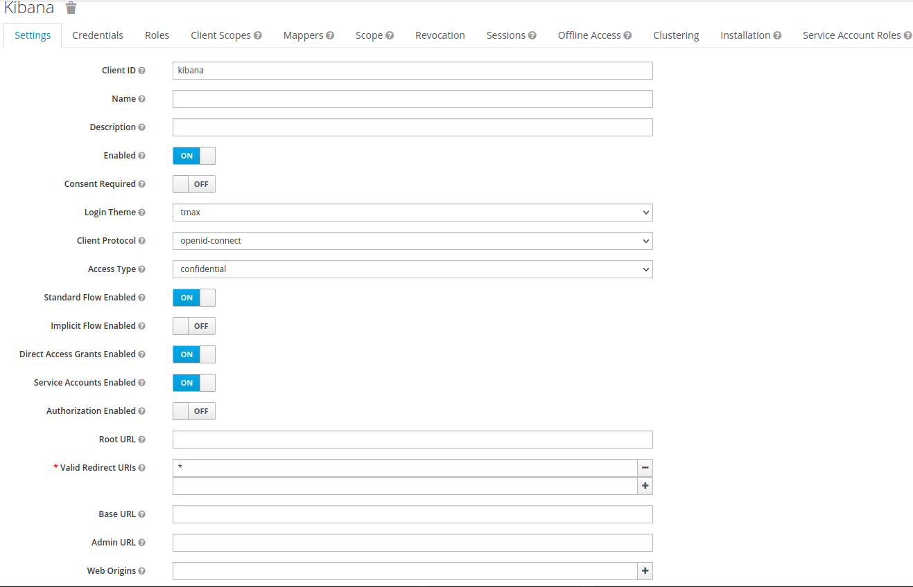
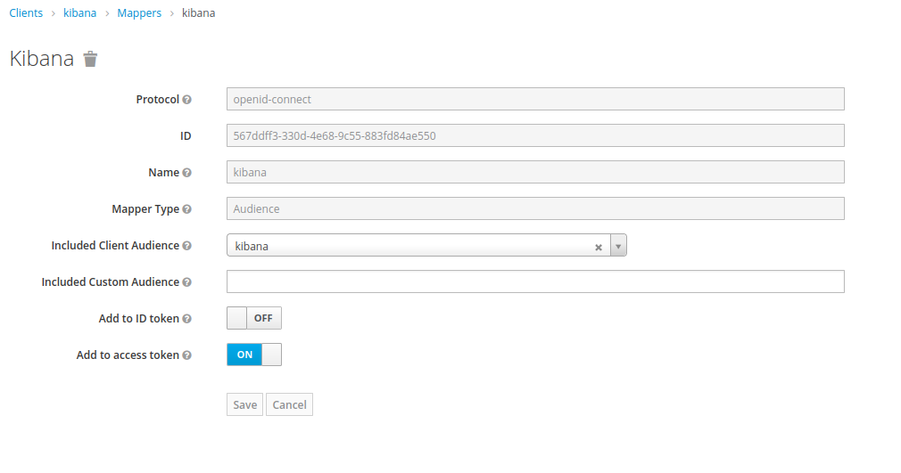
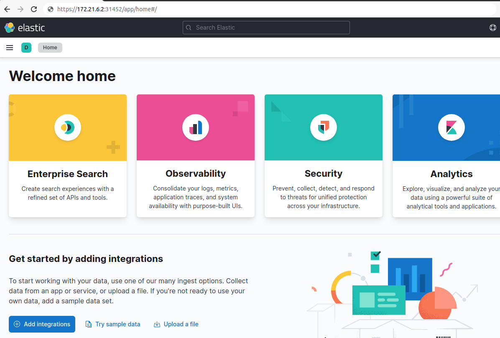
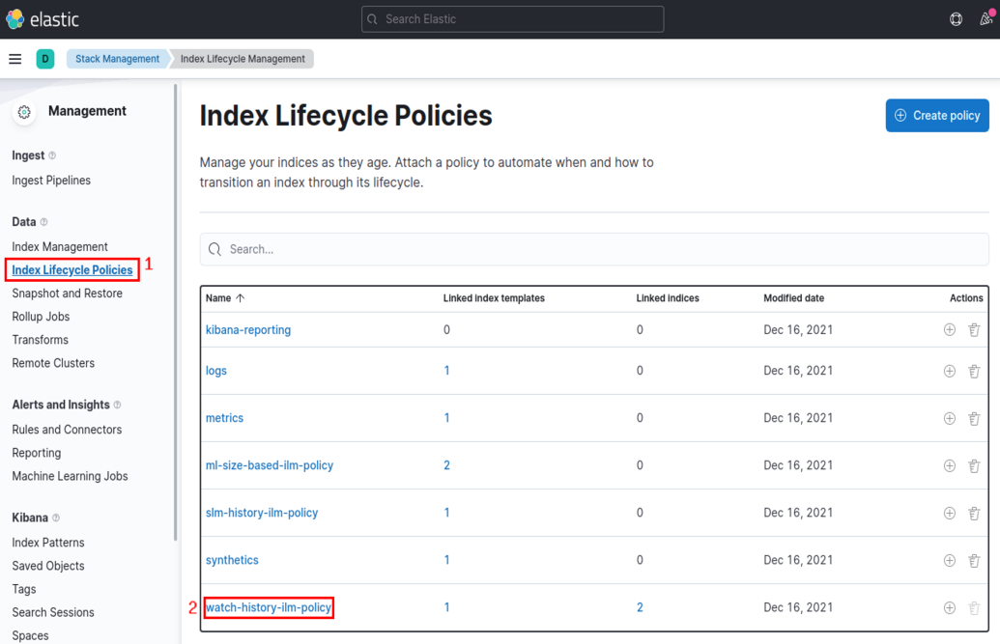
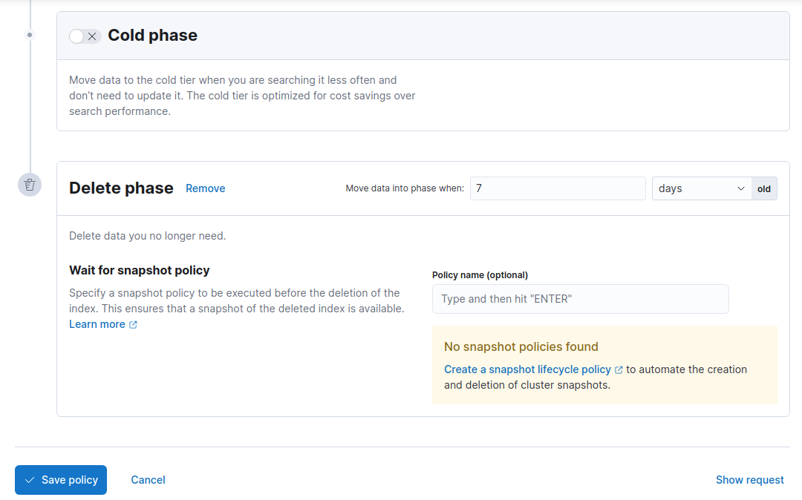
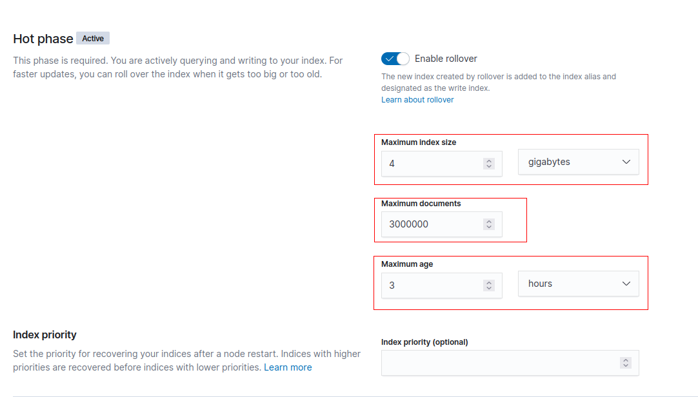
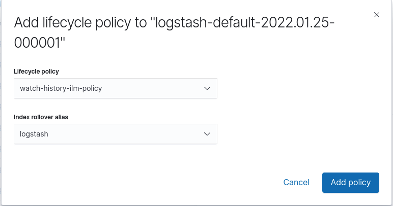
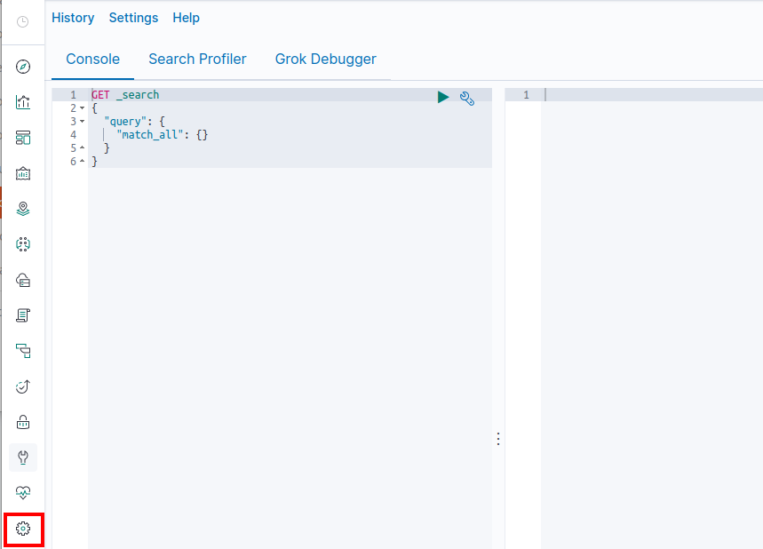
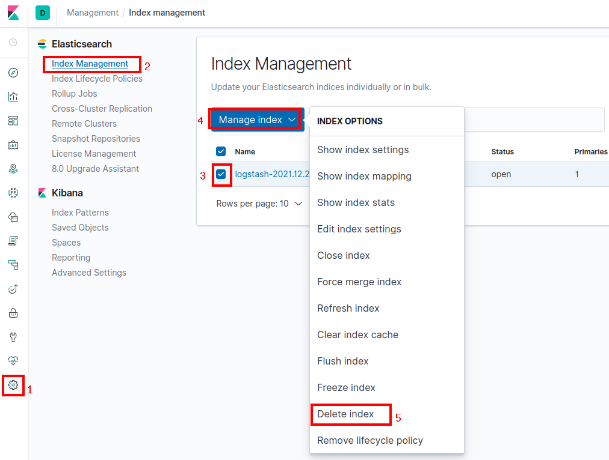

# EFK 설치 가이드

## 구성 요소 및 버전
* elasticsearch ([docker.io/tmaxcloudck/elasticsearch:7.2.1](https://hub.docker.com/r/tmaxcloudck/elasticsearch/tags))
* kibana ([docker.elastic.co/kibana/kibana:7.2.0](https://www.docker.elastic.co/r/kibana/kibana?limit=50&offset=0&show_snapshots=false))
  * gatekeeper sidecar ([quay.io/keycloak/keycloak-gatekeeper:10.0.0](https://quay.io/repository/keycloak/keycloak-gatekeeper))
* fluentd ([fluent/fluentd-kubernetes-daemonset:v1.4.2-debian-elasticsearch-1.1](https://hub.docker.com/layers/fluent/fluentd-kubernetes-daemonset/v1.4.2-debian-elasticsearch-1.1/images/sha256-ce4885865850d3940f5e5318066897b8502c0b955066392de7fd4ef6f1fd4275?context=explore))
  * rollover 적용 시 fluentd 버전을 [fluent/fluentd-kubernetes-daemonset:v1.14.3-debian-elasticsearch7-1.0](https://hub.docker.com/layers/fluent/fluentd-kubernetes-daemonset/v1.14.3-debian-elasticsearch7-1.0/images/sha256-a7d7bd65c3ff91fa3c27e65163aca1b9d968edb3dd9fa893553e5de6af3afb46?context=explore)로 적용
* busybox ([busybox:1.32.0](https://hub.docker.com/layers/busybox/library/busybox/1.32.0/images/sha256-414aeb860595d7078cbe87abaeed05157d6b44907fbd7db30e1cfba9b6902448?context=explore))

## Log4j 보안 취약점 조치 사항
* 목적: Log4j 2.11.1 버전을 사용하는 Elasticsearch에 대하여 [CVE-2021-44228](https://cve.mitre.org/cgi-bin/cvename.cgi?name=CVE-2021-44228), [CVE-2021-45046](https://cve.mitre.org/cgi-bin/cvename.cgi?name=CVE-2021-45046), [CVE-2021-45105](https://cve.mitre.org/cgi-bin/cvename.cgi?name=CVE-2021-45105)에 해당하는 취약점을 보완
	* [CVE-2021-44832](https://cve.mitre.org/cgi-bin/cvename.cgi?name=CVE-2021-44832) 취약점으로 인하여 log4j 2.17.1 버전으로 upgrade 필요
* 조치 내용:
	* Elasticsearch: 7.2.0에서 log4j 2.17.1 버전으로 교체한 이미지 빌드 후 적용 [tmaxcloudck/elasticsearch:7.2.1](https://hub.docker.com/r/tmaxcloudck/elasticsearch/tags)
	* Kibana: Elasticsearch 7.2.0 호환을 위해 7.2.0 버전 적용

## Prerequisites
* 필수 모듈
  * [RookCeph](https://github.com/tmax-cloud/hypersds-wiki/)
  * [Hyperauth](https://github.com/tmax-cloud/hyperauth)
* sidecar injection 사용시
  * [webhook](https://github.com/tmax-cloud/install-hypercloud/tree/5.0)
  * [efk-operator](https://github.com/tmax-cloud/efk-operator)

## 폐쇄망 설치 가이드
* 설치를 진행하기 전 아래의 과정을 통해 필요한 이미지 및 yaml 파일을 준비한다.
* 그 후, Install Step을 진행하면 된다.
1. 사용하는 image repository에 EFK 설치 시 필요한 이미지를 push한다. 

    * 작업 디렉토리 생성 및 환경 설정
    ```bash
    $ mkdir -p ~/efk-install
    $ export EFK_HOME=~/efk-install
    $ cd $EFK_HOME
    $ export ES_VERSION=7.2.1
    $ export KIBANA_VERSION=7.2.0
    $ export GATEKEEPER_VERSION=10.0.0
    $ export FLUENTD_VERSION=v1.4.2-debian-elasticsearch-1.1 # rollover v1.14.3-debian-elasticsearch7-1.0
    $ export BUSYBOX_VERSION=1.32.0
    $ export REGISTRY={ImageRegistryIP:Port}
    ```
    * 외부 네트워크 통신이 가능한 환경에서 필요한 이미지를 다운받는다.
    ```bash
    $ sudo docker pull docker.io/tmaxcloudck/elasticsearch:${ES_VERSION}
    $ sudo docker save docker.io/tmaxcloudck/elasticsearch:${ES_VERSION} > elasticsearch_${ES_VERSION}.tar
    $ sudo docker pull docker.elastic.co/kibana/kibana:${KIBANA_VERSION}
    $ sudo docker save docker.elastic.co/kibana/kibana:${KIBANA_VERSION} > kibana_${KIBANA_VERSION}.tar
    $ sudo docker pull quay.io/keycloak/keycloak-gatekeeper:${GATEKEEPER_VERSION}
    $ sudo docker save quay.io/keycloak/keycloak-gatekeeper:${GATEKEEPER_VERSION} > gatekeeper_${GATEKEEPER_VERSION}.tar
    $ sudo docker pull fluent/fluentd-kubernetes-daemonset:${FLUENTD_VERSION}
    $ sudo docker save fluent/fluentd-kubernetes-daemonset:${FLUENTD_VERSION} > fluentd_${FLUENTD_VERSION}.tar
    $ sudo docker pull busybox:${BUSYBOX_VERSION}
    $ sudo docker save busybox:${BUSYBOX_VERSION} > busybox_${BUSYBOX_VERSION}.tar
    ```
  
2. 위의 과정에서 생성한 tar 파일들을 폐쇄망 환경으로 이동시킨 뒤 사용하려는 registry에 이미지를 push한다.
    ```bash
    $ sudo docker load < elasticsearch_${ES_VERSION}.tar
    $ sudo docker load < kibana_${KIBANA_VERSION}.tar
    $ sudo docker load < gatekeeper_${GATEKEEPER_VERSION}.tar
    $ sudo docker load < fluentd_${FLUENTD_VERSION}.tar
    $ sudo docker load < busybox_${BUSYBOX_VERSION}.tar
    
    $ sudo docker tag docker.io/tmaxcloudck/elasticsearch:${ES_VERSION} ${REGISTRY}/tmaxcloudck/elasticsearch:${ES_VERSION}
    $ sudo docker tag docker.elastic.co/kibana/kibana:${KIBANA_VERSION} ${REGISTRY}/kibana/kibana:${KIBANA_VERSION}
    $ sudo docker tag quay.io/keycloak/keycloak-gatekeeper:${GATEKEEPER_VERSION} ${REGISTRY}/keycloak/keycloak-gatekeeper:${GATEKEEPER_VERSION}
    $ sudo docker tag fluent/fluentd-kubernetes-daemonset:${FLUENTD_VERSION} ${REGISTRY}/fluentd-kubernetes-daemonset:${FLUENTD_VERSION}
    $ sudo docker tag busybox:${BUSYBOX_VERSION} ${REGISTRY}/busybox:${BUSYBOX_VERSION}
    
    $ sudo docker push ${REGISTRY}/tmaxcloudck/elasticsearch:${ES_VERSION}
    $ sudo docker push ${REGISTRY}/kibana/kibana:${KIBANA_VERSION}
    $ sudo docker push ${REGISTRY}/keycloak/keycloak-gatekeeper:${GATEKEEPER_VERSION}
    $ sudo docker push ${REGISTRY}/fluentd-kubernetes-daemonset:${FLUENTD_VERSION}
    $ sudo docker push ${REGISTRY}/busybox:${BUSYBOX_VERSION}
    ```
## Hyperauth 연동
* 목적: `Kibana와 Hyperauth 연동`
* 순서:
    *  hyperauth에서 client 생성
    	* Client protocol = openid-connect
    	* Access type = confidential 
    	* Standard Flow Enabled = On 
    	* Direct Access Grants Enabled = On
    	* Service Accounts Enabled = On
    	* Valid Redirect URIs: '*'
    * Client > kibana > Credentials > client_secret 복사 후 KIBANA_CLIENT_SECRET을 채운다.
    * Client > kibana > Roles > add role로 'kibana-manager' role 생성
    * Client > kibana > Mappers > create로 mapper 생성
    	* Name = kibana
    	* Mapper Type = Audience
    	* Included Client Audience = kibana    
    * Kibana를 사용하고자 하는 사용자의 계정의 Role Mappings 설정에서 kibana-manager Client role을 할당한다.

* Client 생성


* Mapper 생성



## Step 0. efk.config 설정
* 목적 : `yaml/efk.config 파일에 설치를 위한 정보 기입`
* 순서: 
	* 환경에 맞는 config 내용 작성
		* ES_VERSION
			* ElasticSearch 의 버전
			* ex) 7.2.1
		* KIBANA_VERSION
			* Kibana 의 버전
			* ex) 7.2.0
		* GATEKEEPER_VERSION
			* Gatekeeper 의 버전
			* ex) 10.0.0
        * HYPERAUTH_URL
            * Hyperauth 의 URL
            * ex) hyperauth.org
        * KIBANA_CLIENT_SECRET
            * Hyperauth 에 생성된 kibana client 의 secret
            * ex) e720562b-e986-47ff-b040-9513b91989b9
        * ENCRYPTION_KEY
            * Session 암호화에 사용할 랜덤 암호화 키
            * 설정 참고: https://gogatekeeper.github.io/configuration/#encryption-key
            * ex) AgXa7xRcoClDEU0ZDSH4X0XhL5Qy2Z2j 
		* CUSTOM_DOMAIN_NAME
			* Ingress로 접근 요청할 사용자 지정 도메인 이름
			* ex) tmaxcloud.org
		* FLUENTD_VERSION
			* FLUENTD_VERSION 의 버전
			* ex) v1.4.2-debian-elasticsearch-1.1
			* 비고: rollover index 적용 시 v1.14.3-debian-elasticsearch7-1.0 버전으로 적용
		* BUSYBOX_VERSION
			* BUSYBOX_VERSION 의 버전
			* ex) 1.32.0
		* STORAGECLASS_NAME
			* ElasticSearch가 사용할 StorageClass 의 이름
            * {STORAGECLASS_NAME} 그대로 유지시 default storageclass 사용
			* ex) csi-cephfs-sc
		* REGISTRY
			* 폐쇄망 사용시 image repository의 주소
			* 폐쇄망 아닐시 {REGISTRY} 그대로 유지
			* ex) 192.168.171:5000

## Step 1. installer 실행
* 목적 : `설치를 위한 shell script 실행`
* 순서: 
	* 권한 부여 및 실행
	``` bash
	$ sudo chmod +x yaml/install_EFK.sh
	$ sudo chmod +x yaml/uninstall_EFK.sh
	$ ./yaml/install_EFK.sh
	```

## 비고
* Kibana의 서비스 타입 변경을 원하는 경우
    * yaml/02_kibana.yaml 파일에서 Service의 spec.type 수정

## 삭제 가이드
* 목적 : `삭제를 위한 shell script 실행`
* 순서: 
	* 실행
	``` bash
	$ ./yaml/uninstall.sh
	```

## 수동 설치 가이드
## Prerequisites
1. Namespace 생성
    * EFK를 설치할 namespace를 생성한다.
    ```bash
    $ kubectl create ns kube-logging
    ```
2. 변수 export
    * 다운 받을 버전을 export한다. 
    ```bash
    $ export ES_VERSION=7.2.1
    $ export KIBANA_VERSION=7.2.0
    $ export GATEKEEPER_VERSION=10.0.0
    $ export FLUENTD_VERSION=v1.4.2-debian-elasticsearch-1.1 # rollover v1.14.3-debian-elasticsearch7-1.0
    $ export BUSYBOX_VERSION=1.32.0
    $ export STORAGECLASS_NAME=csi-cephfs-sc
    ```
    * Hyperauth 연동 관련 스펙을 export 한다.
    ```bash
    $ export HYPERAUTH_URL=hyperauth.org
    $ export KIBANA_CLIENT_SECRET=e720562b-e986-47ff-b040-9513b91989b9
    $ export ENCRYPTION_KEY=AgXa7xRcoClDEU0ZDSH4X0XhL5Qy2Z2j
    $ export CUSTOM_DOMAIN_NAME=tmaxcloud.org
    ```
    

* 비고  
    * 이하 인스톨 가이드는 StorageClass 이름이 csi-cephfs-sc 라는 가정하에 진행한다.

## Install Steps
0. EFK yaml 수정
1. ElasticSearch 설치
2. Kibana 설치
3. Fluentd 설치

## Step 0. EFK yaml 수정
* 목적 : `EFK yaml에 이미지 registry, 버전 및 노드 정보를 수정`
* 생성 순서 : 
    * 아래의 command를 사용하여 사용하고자 하는 image 버전을 입력한다.
	```bash
	$ sed -i 's/{BUSYBOX_VERSION}/'${BUSYBOX_VERSION}'/g' 01_elasticsearch.yaml
	$ sed -i 's/{ES_VERSION}/'${ES_VERSION}'/g' 01_elasticsearch.yaml
	$ sed -i 's/{STORAGECLASS_NAME}/'${STORAGECLASS_NAME}'/g' 01_elasticsearch.yaml
	$ sed -i 's/{KIBANA_VERSION}/'${KIBANA_VERSION}'/g' 02_kibana.yaml
    $ sed -i 's/{GATEKEEPER_VERSION}/'${GATEKEEPER_VERSION}'/g' 02_kibana.yaml
    $ sed -i 's/{HYPERAUTH_URL}/'${HYPERAUTH_URL}'/g' 02_kibana.yaml
    $ sed -i 's/{KIBANA_CLIENT_SECRET}/'${KIBANA_CLIENT_SECRET}'/g' 02_kibana.yaml
    $ sed -i 's/{ENCRYPTION_KEY}/'${ENCRYPTION_KEY}'/g' 02_kibana.yaml
    $ sed -i 's/{CUSTOM_DOMAIN_NAME}/'${CUSTOM_DOMAIN_NAME}'/g' 02_kibana.yaml
	$ sed -i 's/{FLUENTD_VERSION}/'${FLUENTD_VERSION}'/g' 03_fluentd.yaml
  	$ sed -i 's/{FLUENTD_VERSION}/'${FLUENTD_VERSION}'/g' 03_fluentd_cri-o.yaml
	```
* 비고 :
    * `폐쇄망에서 설치를 진행하여 별도의 image registry를 사용하는 경우 registry 정보를 추가로 설정해준다.`
	```bash
	$ sed -i 's/docker.io\/tmaxcloudck\/elasticsearch/'${REGISTRY}'\/tmaxcloudck\/elasticsearch/g' 01_elasticsearch.yaml
	$ sed -i 's/busybox/'${REGISTRY}'\/busybox/g' 01_elasticsearch.yaml
	$ sed -i 's/docker.elastic.co\/kibana\/kibana/'${REGISTRY}'\/kibana\/kibana/g' 02_kibana.yaml
    $ sed -i 's/quay.io\/keycloak\/keycloak-gatekeeper/'${REGISTRY}'\/keycloak\/keycloak-gatekeeper/g' 02_kibana.yaml
	$ sed -i 's/fluent\/fluentd-kubernetes-daemonset/'${REGISTRY}'\/fluentd-kubernetes-daemonset/g' 03_fluentd.yaml
	$ sed -i 's/fluent\/fluentd-kubernetes-daemonset/'${REGISTRY}'\/fluentd-kubernetes-daemonset/g' 03_fluentd_cri-o.yaml
	```    
    
## Step 1. ElasticSearch 설치
* 목적 : `ElasticSearch 설치`
* 생성 순서 : 
    * [01_elasticsearch.yaml](yaml/01_elasticsearch.yaml) 실행
	```bash
	$ kubectl apply -f 01_elasticsearch.yaml
	```     
* 비고 :
    * StorageClass 이름이 csi-cephfs-sc가 아니라면 환경에 맞게 수정해야 한다.
    * Elasticsearch 7.16.1 version에서 downgrade 적용 시 error: cannot downgrade a node from version [7.16.1] to [7.2.0] 대응
    	* 기존 elasticsearch cluster의 persistentVolumeClaim 삭제 후 yaml 재실행
    	* ex) kubectl delete pvc data-es-cluster-0 -n kube-logging

## Step 2. Kibana 설치
* 목적 : `EFK의 UI 모듈인 Kibana를 설치`
* 생성 순서 : [02_kibana.yaml](yaml/02_kibana.yaml) 실행 
    ```bash
    $ kubectl apply -f 02_kibana.yaml
    ```
* 비고 :
    * Kibana pod 가 running 임을 확인한 뒤 https://kibana.${CUSTOM_DOMAIN_NAME}/ 에 접속한다.
    * Kibana-manager role을 할당한 Hyperauth 사용자 계정으로 로그인해서 정상 작동을 확인한다.
    * $CUSTOM_DOMAIN_NAME 은 kubectl get ingress -n kube-logging | grep kibana를 통해 조회 가능
   

## Step 3. Fluentd 설치
* 목적 : `EFK의 agent daemon 역할을 수행하는 Fluentd를 설치`
* 생성 순서 : 03_fluentd~.yaml 실행  
  1. Container Runtime이 cri-o 인 경우  
    * [03_fluentd_cri-o.yaml](yaml/03_fluentd_cri-o.yaml) 실행
      ``` bash
      $ kubectl apply -f 03_fluentd_cri-o.yaml
      ```
  * rollover index 적용 시
      * [03_fluentd_cri-o_rollover.yaml](yaml/03_fluentd_cri-o_rollover.yaml) 실행
      ``` bash
      $ kubectl apply -f 03_fluentd_cri-o_rollover.yaml
      ```

  2. Container Runtime이 docker 인 경우  
    * [03_fluentd.yaml](yaml/03_fluentd.yaml) 실행 
      ```bash
      $ kubectl apply -f 03_fluentd.yaml
      ```
## 비고
* ILM policy 설정
    * 설치 시, default로 생성되는 watch-history-ilm-policy를 적용시키게 되어있다.
    * watch-history-ilm-policy는 생성된 지 7일이 지난 인덱스는 자동으로 삭제한다.
      * 단, rollover 설정 시 rollover된 지 7일이 지난 인덱스를 자동으로 삭제한다.
    * policy를 수정하고 싶다면, kibana에서 아래와 같이 Index Lifecycle Policies 메뉴를 들어가서 watch-history-ilm-policy를 클릭한다.
    
    * 해당 페이지에서 policy를 커스터마이징 후, Save policy를 클릭한다.
    
    
## ILM policy enable rollover 설정
* Watch-History-ILM-Policy > Hot phase > enable rollover 적용. 아래의 3가지 조건 중 하나라도 해당될 경우 rollover를 실행
    * Maximum Index size : 인덱스가 특정 사이즈(storagesize)에 도달했을 경우 rollover 실행
    * Maximum documents: 인덱스에 저장된 docs count가 특정 숫자에 도달했을 경우 rollover 실행 
    * Maximum age: 인덱스가 생성된 시간으로부터 특정 시간이 지난 경우 rollover 실행

* 설정된 ILM이 해당 index에 반영되어 있는지 확인
* 미반영 시, 해당 index > manage index> remove lifecycle policy 로 ILM 적용을 지운 후 다시 add lifecycle policy로 재적용




* ElasticSearch에 HTTP 콜 하는 방법
    * ElasticSearch UI 좌측에 스패너 모양을 클릭한다.
    * HTTP 콜 작성 후 ▶ 버튼 클릭
        

* 에러 해결법
    * Limit of total fields [1000] in index 에러
        * 원인 : 저장하려는 field 갯수가 index의 field limit보다 큰 경우
        * 해결 : index.mapping.total_fields.limit 증가 HTTP 콜 실행
        ```
        PUT {index 이름}/_settings
        {
            "index.mapping.total_fields.limit": 2000
        }
        ```
    * index read-only 에러
        * 원인 : 디스크 사용량이 flood-stage watermark 수치를 넘어서면 ES가 자동적으로 저장을 막음 (default 값은 95%)
        * 해결 (택1)
            * 필요없는 인덱스를 삭제해서 용량 확보
            
            * HTTP콜을 통해 read-only 해제하기
            ```
            PUT /{index 이름}/_settings
            {
                "index.blocks.read_only_allow_delete": null
            }
            ```
